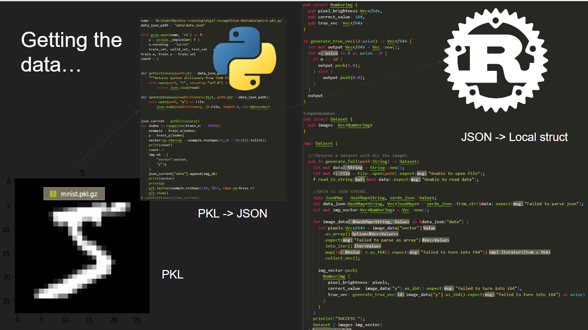
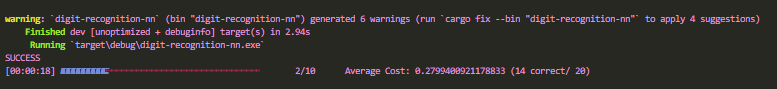

<!-- Improved compatibility of back to top link: See: https://github.com/othneildrew/Best-README-Template/pull/73 -->
<a name="readme-top"></a>
<!--
*** Thanks for checking out the Best-README-Template. If you have a suggestion
*** that would make this better, please fork the repo and create a pull request
*** or simply open an issue with the tag "enhancement".
*** Don't forget to give the project a star!
*** Thanks again! Now go create something AMAZING! :D
-->


<!-- PROJECT SHIELDS -->
<!--
*** I'm using markdown "reference style" links for readability.
*** Reference links are enclosed in brackets [ ] instead of parentheses ( ).
*** See the bottom of this document for the declaration of the reference variables
*** for contributors-url, forks-url, etc. This is an optional, concise syntax you may use.
*** https://www.markdownguide.org/basic-syntax/#reference-style-links
-->
[![Contributors][contributors-shield]][contributors-url]
[![Forks][forks-shield]][forks-url]
[![Stargazers][stars-shield]][stars-url]
[![Issues][issues-shield]][issues-url]
[![MIT License][license-shield]][license-url]


<!-- PROJECT LOGO -->
<br />
<div align="center">
  <a href="https://user-images.githubusercontent.com/83039642/209047770-ecc908db-65f4-46d9-88c6-1957ac7ec625.png">
    
  </a>

<h3 align="center">Classifying MNIST from scratch.</h3>

  <p align="center">
    This is code that classifies the MNIST dataset, which is a dataset of 50,000 handwritten digits. I used a deep neural network with layers sizes 784, 684, 584, 484, 392, 100, 10. I use sigmoid for activation functions, but have experimented with relu.
    <br /> 
    <a href="https://www.manim.community"><strong>Explore the docs »</strong></a>
    <br />
    <br />
    <a href="https://www.youtube.com/watch?v=Okraa2ZElrE">Watch the video!</a>
    ·
    <a href="https://github.com/Sentientplatypus/circle-area-proof/issues">Report Bug</a>
    ·
    <a href="https://github.com/Sentientplatypus/circle-area-proof/issues">Request Feature</a>
  </p>
</div>


<!-- TABLE OF CONTENTS -->
<details>
  <summary>Table of Contents</summary>
  <ol>
    <li>
      <a href="#about-the-project">About The Project</a>
      <ul>
        <li><a href="#built-with">Built With</a></li>
      </ul>
    </li>
    <li>
      <a href="#getting-started">Getting Started</a>
      <ul>
        <li><a href="#prerequisites">Prerequisites</a></li>
        <li><a href="#installation">Installation</a></li>
      </ul>
    </li>
    <li><a href="#usage">Usage</a></li>
    <li><a href="#roadmap">Roadmap</a></li>
    <li><a href="#contributing">Contributing</a></li>
    <li><a href="#license">License</a></li>
    <li><a href="#contact">Contact</a></li>
    <li><a href="#acknowledgments">Acknowledgments</a></li>
  </ol>
</details>


<!-- ABOUT THE PROJECT -->
## About The Project


I watched 3b1b's video. I thought that was really cool, so I tried to do it from scratch. 
Pretty much, this program takes the brightness value of each pixel of the written digit, flattens the 28x28 image into a 784 element vector, and uses that as an input into a neural network. Then, we feedforward and backpropagate.  
I was also learning rust at the time, so I did it in rust! It was a good learning experience for both rust learning and neural network theory. When I got stuck, or my net seemed like it was just guessing, I got tips from my friend <a href="https://github.com/junyoung-sim">jun</a>. He let me use his dads lecture notes which helped, and sauced me a page of differentials for the backpropagation. This was really fun to develop. I had to get the dataset in rust though, and that was hard. That is what `getData.py` is for. I parse the pkl file into a json, and then rust can read the json.

<p align="right">(<a href="#readme-top">back to top</a>)</p>


### Built With

* [![Next][rust]][rust-url]
* [![Next][python]][python-url]

<p align="right">(<a href="#readme-top">back to top</a>)</p>


<!-- GETTING STARTED -->
## Getting Started

Everything is in the crate! 

well, almost everything.

### Prerequisites


* You first need to install rust, see the [documentation](https://doc.rust-lang.org/book/ch01-03-hello-cargo.html)
* for our parsing tool, you will need these dependencies:
    * `gzip`
    * `pickle`
    * `matplotlib`
    * `numpy`
* Additionally, if you want to run the pytorch solution to MNIST, you will obviously need `torch`


### Installation


1. Clone the repo
   ```sh
   git clone https://github.com/Sentientplatypus/circle-area-proof.git
   ```
2. Run the crate with 
    ```sh
    cargo run
    ```
3. Additional requirements based upon your needs as mentioned in the previous section.


<p align="right">(<a href="#readme-top">back to top</a>)</p>


<!-- USAGE EXAMPLES -->
## Usage
To load the dataset, you will need to create a new `Dataset` with the `Dataset::generate_full(file_path:String)`.

The network architecture is stored in a `Network` struct. The `Network` aggregates the `Layer` struct. The `Layer` struct aggregates `Neuron`. For running, you can create a new instance of `Network` with `Network::new()`. where you can pass in the layer sizes as an array, and whether it is binary output or not. 

You can run the training through the `Network.sgd()` method. A gui like this should pop up.


After your training, you can choose to save your network parameters with the `Network.to_file(path:String)` method.

_For more examples, please refer to the `main.rs` file_

<p align="right">(<a href="#readme-top">back to top</a>)</p>


<!-- ROADMAP -->
## Roadmap

- [x] Create classes and research
- [x] Binary Classification
- [x] Multiclassification
    - [x] Softmax + Cross Entropy Loss

See the [open issues](https://github.com/Sentientplatypus/circle-area-proof/issues) for a full list of proposed features (and known issues).

<p align="right">(<a href="#readme-top">back to top</a>)</p>


<!-- CONTRIBUTING -->
## Contributing

Contributions are what make the open source community such an amazing place to learn, inspire, and create. Any contributions you make are **greatly appreciated**.

If you have a suggestion that would make this better, please fork the repo and create a pull request. You can also simply open an issue with the tag "enhancement".
Don't forget to give the project a star! Thanks again!

1. Fork the Project
2. Create your Feature Branch (`git checkout -b feature/AmazingFeature`)
3. Commit your Changes (`git commit -m 'Add some AmazingFeature'`)
4. Push to the Branch (`git push origin feature/AmazingFeature`)
5. Open a Pull Request

<p align="right">(<a href="#readme-top">back to top</a>)</p>


<!-- CONTACT -->
## Contact

Geneustace Wicaksono - [My Website](https://genewica.herokuapp.com) - geneustacewicaksono@yahoo.com

Project Link: [https://github.com/Sentientplatypus/circle-area-proof](https://github.com/Sentientplatypus/circle-area-proof)

<p align="right">(<a href="#readme-top">back to top</a>)</p>


<!-- ACKNOWLEDGMENTS -->
## Acknowledgments

* [Junyoung Sim](https://github.com/junyoung-sim)


<p align="right">(<a href="#readme-top">back to top</a>)</p>


<!-- MARKDOWN LINKS & IMAGES -->
<!-- https://www.markdownguide.org/basic-syntax/#reference-style-links -->
[contributors-shield]: https://img.shields.io/github/contributors/Sentientplatypus/circle-area-proof.svg?style=for-the-badge
[contributors-url]: https://github.com/Sentientplatypus/circle-area-proof/graphs/contributors
[forks-shield]: https://img.shields.io/github/forks/Sentientplatypus/circle-area-proof.svg?style=for-the-badge
[forks-url]: https://github.com/Sentientplatypus/circle-area-proof/network/members
[stars-shield]: https://img.shields.io/github/stars/Sentientplatypus/circle-area-proof.svg?style=for-the-badge
[stars-url]: https://github.com/Sentientplatypus/circle-area-proof/stargazers
[issues-shield]: https://img.shields.io/github/issues/Sentientplatypus/circle-area-proof.svg?style=for-the-badge
[issues-url]: https://github.com/Sentientplatypus/circle-area-proof/issues
[license-shield]: https://img.shields.io/github/license/Sentientplatypus/circle-area-proof.svg?style=for-the-badge
[license-url]: https://github.com/Sentientplatypus/circle-area-proof/blob/master/LICENSE.txt
[linkedin-shield]: https://img.shields.io/badge/-LinkedIn-black.svg?style=for-the-badge&logo=linkedin&colorB=555
[linkedin-url]: https://linkedin.com/in/linkedin_username
[product-screenshot]: image-2.png
[python]: https://img.shields.io/badge/Python-3776AB?style=for-the-badge&logo=python&logoColor=white
[python-url]: https://python.com
[rust]: https://img.shields.io/badge/Rust-000000?style=for-the-badge&logo=rust&logoColor=white
[rust-url]: https://rust.com


